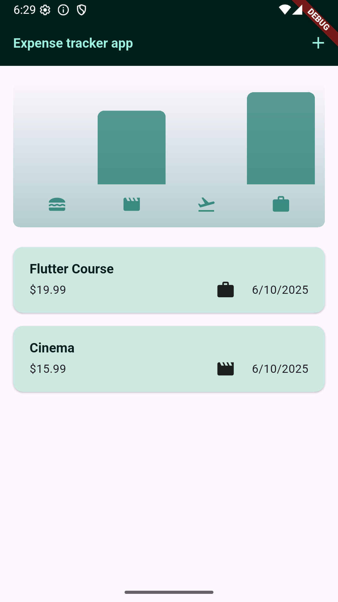
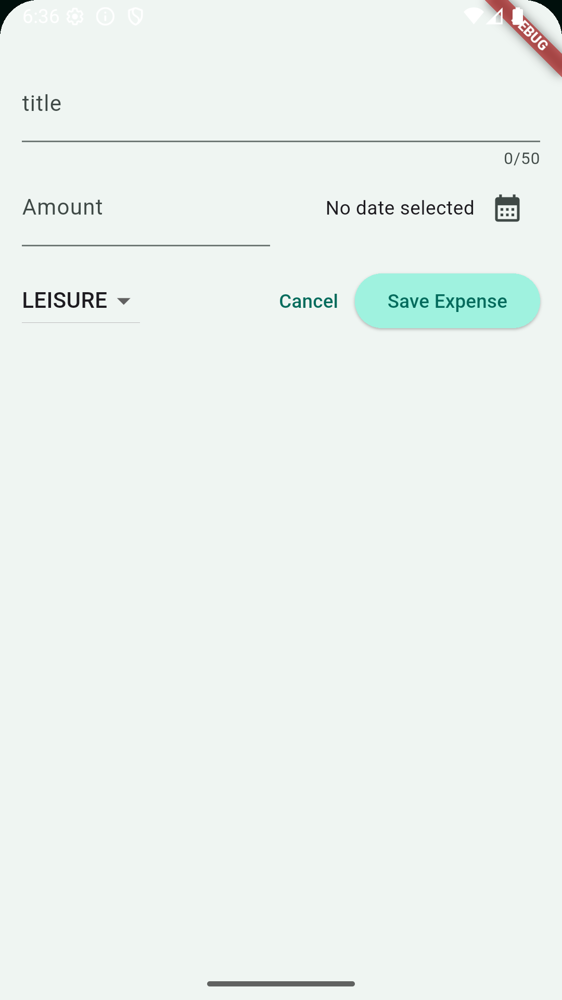

# 💰 Expense Tracker App (Flutter)

A beautiful and intuitive mobile application to track your daily expenses and income. Built with **Flutter** and **Dart**, this app helps users stay on top of their finances by recording transactions, categorizing them, and viewing insightful chart.

---

## 🚀 Features

* 📆 Add and delete transactions
* 🗂️ Categorize expenses (Food, Leisure, travel, work)
* 📊 Bar chart for spending insights
* 📱 Responsive UI 

---

## 🧰 Technologies Used

| Tech               | Description                             |
| ------------------ | --------------------------------------- |
| **Flutter**        | UI toolkit for natively compiled apps   |
| **Dart**           | Programming language used by Flutter    |
| **Charts Flutter** | For generating interactive charts       |
| **Intl**           | For date and currency formatting        |
| **Flutter Icons**  | For consistent UI icons                 |

---

## 📷 Screenshots


| Home Screen                             | New Expenses View                             |
|----------------------------------------|------------------------------------------|
|  |  |
| *Home screen showing recent expenses* | *Adding new expenses interface*       |

---

## 📦 Installation & Setup

1. **Clone the repository**

   ```bash
   git clone https://github.com/jvarghes2501/Expense_tracker_app.git
   cd expense-tracker-flutter
   ```

2. **Install dependencies**

   ```bash
   flutter pub get
   ```

3. **Run the app**

   ```bash
   flutter run
   ```

4. **Build for release**

   ```bash
   flutter build apk   # Android
   flutter build ios   # iOS (requires Xcode)
   ```

---

## 🗂️ Project Structure

```
lib/
├── main.dart                     # Entry point
├── models/                       # Data models (Transaction, Category)
├── widgets/                      # Reusable components
   ├── chart/                      # Bar chart display components
   ├── expenses_list/                      # Scrollable expenses list container and individual expense item display component 

```

---

